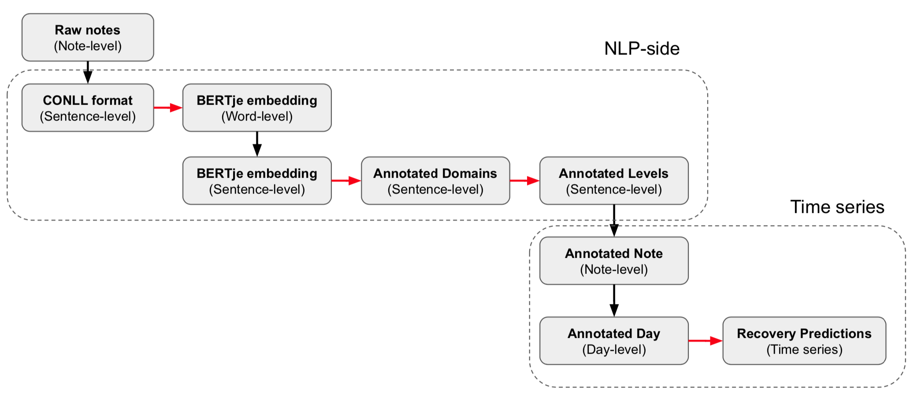

# A-proof: Timeseries 

This directory contains all the most-important code and results for the timeseries component of the A-proof pilot project.



Everything is presented in documented [Jupyter notebooks](https://jupyter.org/) (with some outputs hidden to protect patient privacy). The notebooks, viewed statically, therefore allow a good overview of the code and data, without having to re-run them all.

In particular, [timeseries_analysis.ipynb](/timeseries_analysis.ipynb) and [final_analysis.ipynb](/final_analysis.ipynb) give a useful overview of the findings of this part of the pilot study.

## Directory overview

If you need to re-run any of this code, it's most likely to be:
- `merging_cov.ipynb` and `merging_noncov.ipynb`: these connect annotated sentences from the NLP side to the original medical records and thereby provide a date-time stamp for each note, which is essential for timeseries.
- `patient_selection.ipynb`: this finds Covid patients in the original medical records and selects those who are good candidates for modelling. It also has code to export to Excel-format spreadsheets for expert-annotation at the note level.
- `timeseries_analysis.ipynb`: this analyses (and plots) the ICF levels over time for each patient (for both human-annotated and synthetically-labelled data).

```
/timeseries
├── README.md
├── analysis_annot_covid.ipynb
├── analysis_annot_noncov.ipynb
├── annotation_extraction_cov.ipynb
├── annotation_extraction_noncov.ipynb
├── annotator_experiments.ipynb
├── bag_of_words.ipynb
├── bertje_preprocessing_pipeline.ipynb
├── final_analysis.ipynb
├── merging_cov.ipynb
├── merging_noncov.ipynb
├── overview.png
├── patient_selection.ipynb
├── preliminary_analysis.ipynb
├── timeseries_analysis.ipynb
└── timeseries_experiments.ipynb
```

## Code author

[Gianluca Truda](https://github.com/gianlucatruda)
